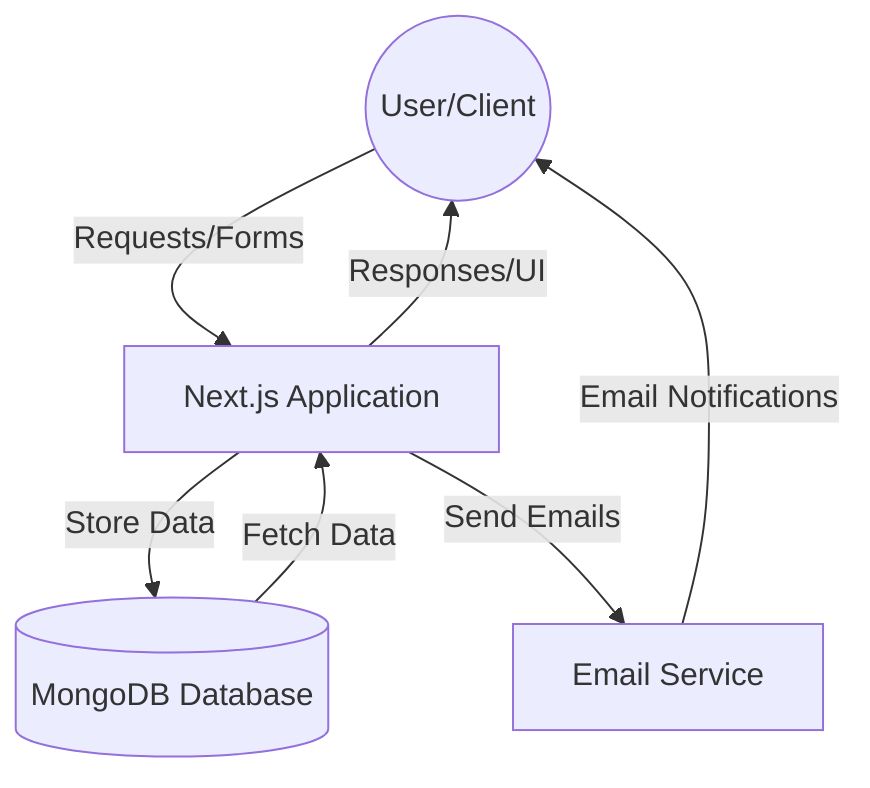
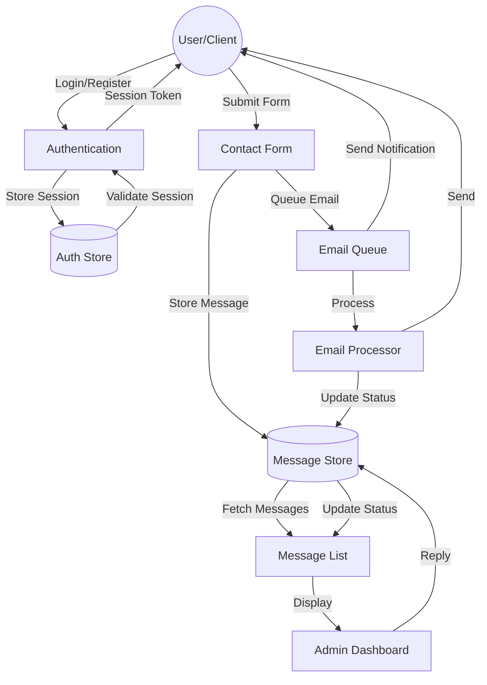
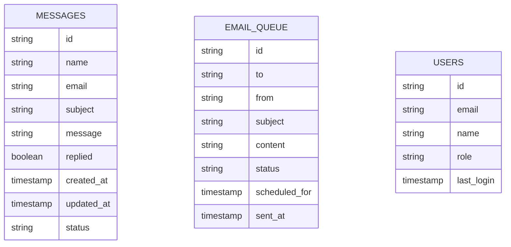

# Project Workflow - Data Flow Diagram

## Level 0 DFD (System Overview)


## Level 1 DFD (Detailed Process Flow)


## Data Stores


## Process Flows

### 1. Contact Form Submission
- User fills out contact form
- Form data validated client-side
- Data sent to Next.js API
- Message stored in MongoDB
- Email notification queued
- Confirmation sent to user

### 2. Message Management
- Admin views message list
- Messages fetched from MongoDB
- Filtered and sorted as needed
- Status updates tracked
- Replies processed and sent
- History maintained

### 3. Email Processing
- Emails queued for sending
- Processed through Resend API
- Delivery status tracked
- Failed sends retried
- Success/failure logged

### 4. Admin Operations
- Dashboard access control
- Message status management
- Reply composition and sending
- Email template management
- Analytics and reporting

## Security Implementation

1. **User Authentication**
   - Session-based auth
   - Secure cookie handling
   - Role-based access control

2. **Data Protection**
   - Input sanitization
   - XSS prevention
   - CSRF protection
   - Rate limiting

3. **Email Security**
   - SPF records
   - DKIM signing
   - Email validation
   - Spam prevention

## Error Handling

1. **Form Submission**
   - Input validation
   - Rate limiting
   - Duplicate prevention
   - Error feedback

2. **Email Processing**
   - Delivery retries
   - Bounce handling
   - Invalid email detection
   - Queue management

3. **System Errors**
   - Error logging
   - Monitoring
   - Alerting
   - Recovery procedures

## API Endpoints

### Contact API
```typescript
POST /api/contact
GET /api/messages
POST /api/messages/reply
GET /api/messages/status
```

### Email API
```typescript
POST /api/email/send
GET /api/email/status
POST /api/email/retry
```

### Admin API
```typescript
GET /api/admin/dashboard
POST /api/admin/settings
GET /api/admin/analytics
``` 